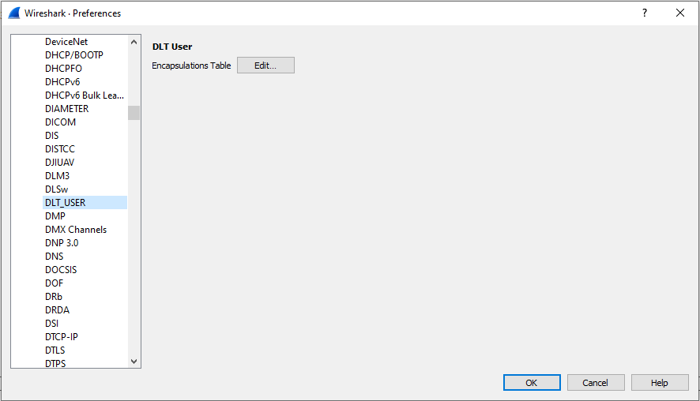
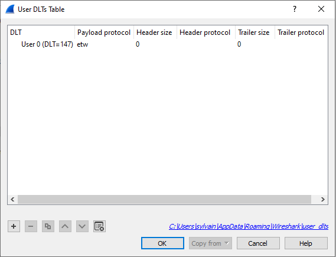
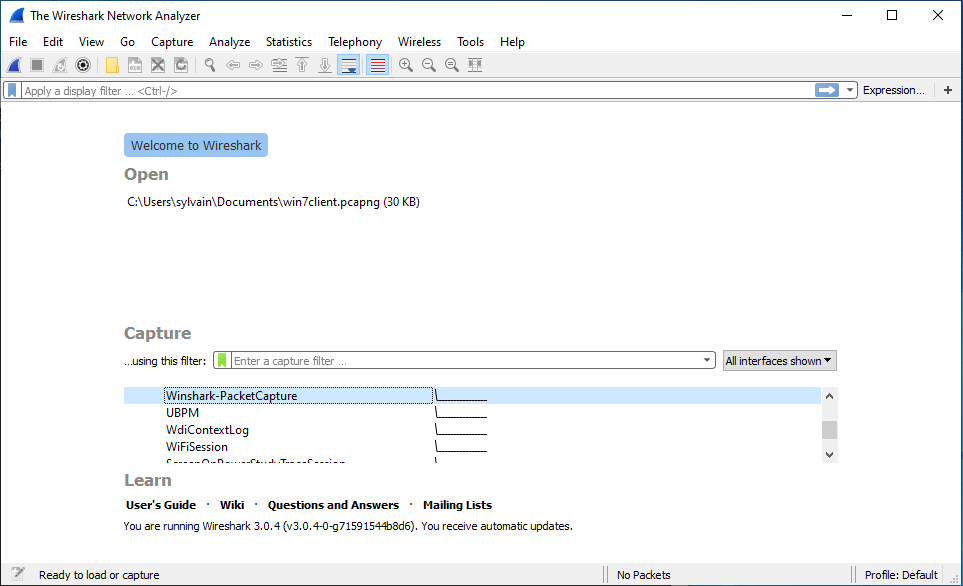
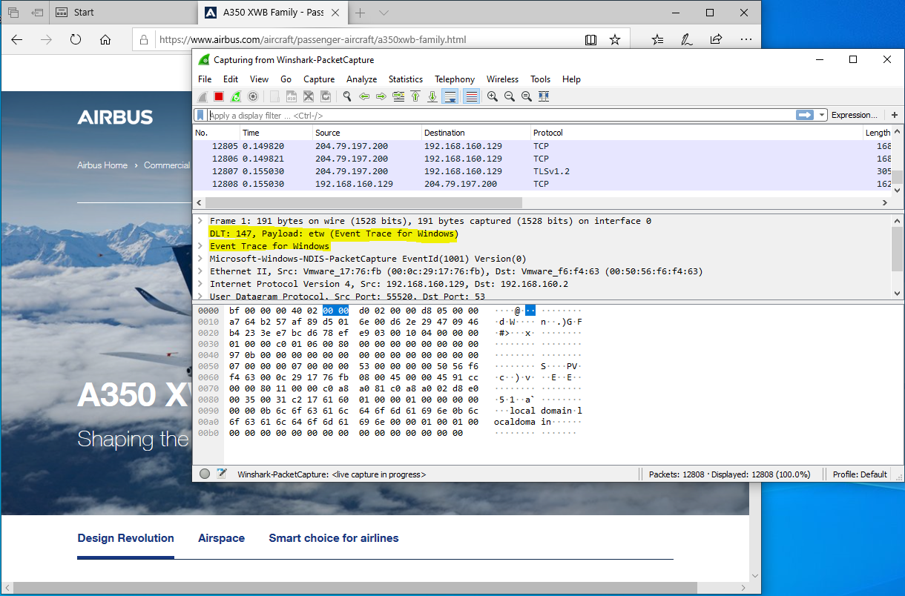
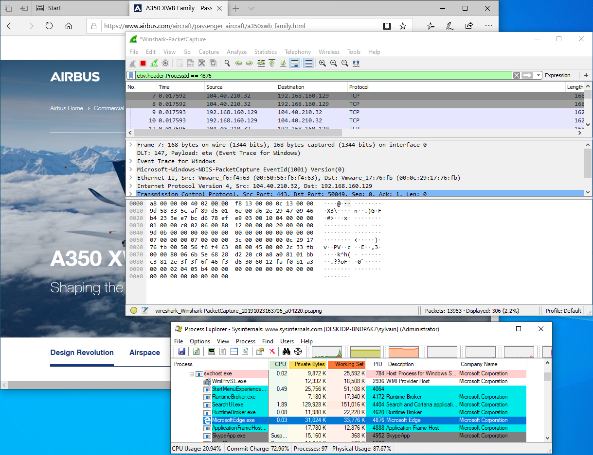

# Winshark
`Wireshark` plugin to work with Event Tracing for Windows

`Microsoft Message Analyzer` is being retired and its download packages were removed from microsoft.com sites on November 25 2019.
Wireshark have built a huge library of network protocol dissectors.
The best tool for Windows would be one that can gather and mix all type of logs...

Welcome `Winshark`!!!

`Winshark` is based on a `libpcap` backend to capture ETW (Event tracing for Windows), and a generator that will produce all dissectors for known ETW providers on your machine.
We've added Tracelogging support to cover almost all log techniques on the Windows Operating System.

With Winshark and the power of Windows, we can now capture Network and Event Logs in the same tool. Windows exposes a lot of ETW providers, in particular one for network capture ;-)
No more need for an external NDIS driver.

This is a huge improvement in terms of use:
* Enable to mix all kind of events (system and network)
* Enable to use Wireshark filtering on event log
* Enable to track network and system logs by Process ID!!!
* Enable to capture Windows log and network trace into an unique pcap file!!!
* Capture NamedPipe through [NpEtw](https://github.com/kobykahane/NpEtw) file system filter driver

If you want to:
* [Capture Network Traffic Using Winshark](#Capture-Network-traffic)
* [Filter on Process ID](#Filtering-on-process-id)
* [Capture NamedPipe Traffic](#Capturing-NamedPipe)

## Install

Please install [Wireshark](https://www.wireshark.org/download.html) before.
Then just install [Winshark](https://github.com/airbus-cert/Winshark/releases).

Currently, you have to ask `Wireshark` to interpret the DLT_USER 147 as ETW. This is because you have not yet a true value from `libpcap` for our new Data Link.
We issued a pull request to have a dedicated DLT value; it is still pending.
To do that you have to open `Preferences` tab under the `Edit` panel. Select `DLT_USER` under `Protocols` and `Edit` the encapsulations table:



And set `etw` for `DLT = 147` :



Enjoy!

## Build

Winshark is powered by `cmake`:

```
git clone https://github.com/airbus-cert/winshark --recursive
mkdir build_winshark
cd build_winshark
cmake ..\Winshark
cmake --build . --target package --config release
```

## How does it work

To better understand how Winshark works, we need to understand how ETW works first.

ETW is splitted into three parts:
* A Provider that will emit log and identified by unique ID
* A Session that will mix one or more providers
* A Consumer that will read logs emitted by a session

### Provider

There is a lot of different kinds of providers. The most common, and usable, are registred providers. A registred provider, or a manifest-based provider, is recorded under the registry key `HKLM\SOFTWARE\Microsoft\Windows\CurrentVersion\WINEVT\Publishers`.
This makes the link between a provider ID and a dll. The manifest is encompassed into the associated dll into a resource name `WEVT_TEMPLATE`.

You can list all providers registred on your machine using `logman`:

```
logman query providers
```

You can also list all providers bound by a particular process:

```
logman query providers -pid 1234
```

Some of them could appears without name; these kinds of provider can produce [WPP](https://posts.specterops.io/data-source-analysis-and-dynamic-windows-re-using-wpp-and-tracelogging-e465f8b653f7) or [TraceLogging](https://posts.specterops.io/data-source-analysis-and-dynamic-windows-re-using-wpp-and-tracelogging-e465f8b653f7) logs.

### Session

Sessions are created to collect logs from more than one provider.
You can create your own session using `logman`:

```
logman start Mysession -p "Microsoft-Windows-RemoteDesktopServices-RdpCoreTS" -ets -rt
logman update MySession -p "Microsoft-Windows-NDIS-PacketCapture" -ets -rt
```

You can list all active sessions from an admin command line:

```
logman query -ets

Data Collector Set                      Type                          Status
-------------------------------------------------------------------------------
...
EventLog-Application                    Trace                         Running
EventLog-Microsoft-Windows-Sysmon-Operational Trace                         Running
EventLog-System                         Trace                         Running
...
The command completed successfully.
```

You can see here some interesting session use by the event logger to capture logs from Application and System sessions and from Sysmon.

### Consumer

A consumer is a simple program that will read logs from a session. Well-known consumers are:
* Event Logger
* `logman`
* `netsh`
* `tracert`

And now `Winshark`!!! `Winshark` is a simple ETW consumer. The real underlying consumer is `libpcap`, (`wpcap.dll` for Windows) which is used by `dumpcap.exe` which is the process in charge of packet capture.

## Wireshark

`Wireshark` is split in three parts (yes, him too):
* `Wireshark.exe` which is in charge of parsing and dissecting protocols
* `dumpcap.exe` which is in charge of capturing packets
* `libpcap` (`wpcap.dll`) which is in charge of interfacing between `dumpcap.exe` and the Operating System

`Winshark` takes place in the first and last parts. It implements a backend for `libpcap` to capture ETW events.
`Winshark` works on ETW sessions, this is why you can select an ETW session in place of Network interface at the start of capture.
Then `Winshark` generates `lua` dissectors for each manifest-based provider registred on your computer, during the installation step.
`Winshark` is also able to parse tracelogging-based providers.

## Capture network traffic

To capture network traffic using `Winshark`, you can use two simple ways:

* pktmon (Packet Monitor)
```
pktmon start -c -m real-mode
```
you can run pktmon -h for more options (as admin)

For instance:
Add a filter for packets
```
pktmon filter add -t icmp
pktmon filter add -t tcp -p 80
```

* netsh trace

```
netsh.exe trace start capture=yes report=no correlation=no
```

And then create an ETW session associated with the `Microsoft-Windows-NDIS-PacketCapture` provider:

```
logman start Winshark-PacketCapture -p "Microsoft-Windows-NDIS-PacketCapture" -rt -ets
```

Then launch `Wireshark` with administrator privileges and select either `Pktmon` or `Winshark-PacketCapture` interface:



That will start the packet capture:



## Filtering on process ID

ETW marks each packet with a header that sets some metadata about the sender.
One of these is the `Process ID` of the emitter. This is a huge improvement from a classic packet capture from an NDIS driver.
Simply fill the filter field of Wireshark with the following expression:

```
etw.header.ProcessId == 1234
```




## Capturing NamedPipe

@kobykahane provide a [file system filter driver](https://docs.microsoft.com/en-us/windows-hardware/drivers/ifs/about-file-system-filter-drivers) that emit an ETW for every action perform on a NamedPipe.

### Install

* Pass driver signing check in test mode
```
bcdedit /set testsigning on
```
* Install [NpEtwSetup.msi](https://github.com/airbus-cert/Winshark/releases)
* Reboot
* Update `Winshark` dissector by double clicking `C:\Program Files\Wireshark\WinsharkUpdate.bat` with `Admin` rights

### Capture

* Open a `cmd.exe` in `Admin mode`
* Start the driver
```
sc start NpEtw
```
* Create an ETW Session
```
logman start namedpipe -p NpEtw -ets -rt
```
* Start `Wireshark` and select the `namedpipe` session. Enjoy!


## SSTIC (Symposium sur la sécurité des technologies de l'information et des communications)

This project is part of a presentation made for [SSTIC](https://www.sstic.org/2020/presentation/quand_les_bleus_se_prennent_pour_des_chercheurs_de_vulnrabilites/)
